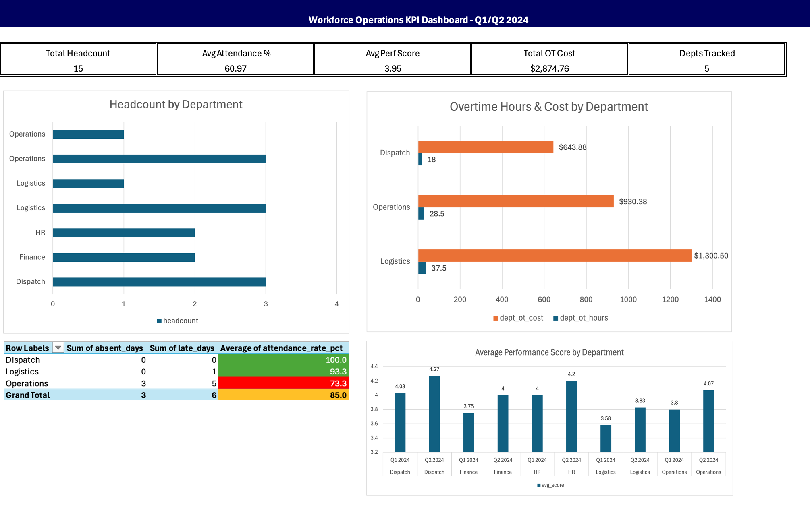

# Workforce Operations & KPI Analysis

**Tools:** SQL (MySQL) · Excel  
**Timeline:** January 2024 – April 2024

## Overview
Built a normalized SQL database to centralize workforce data across 5 departments
and 15 employees, then developed a multi-tab Excel KPI dashboard surfacing
attendance rates, overtime costs, and performance score trends.

## Database Structure
| Table | Description |
|---|---|
| employees | 15 employees across 5 departments |
| attendance | 3 months of daily clock-in/out records |
| performance_reviews | Q1 and Q2 review scores per employee |
| overtime_log | Weekly overtime hours and cost data |

## Key Findings
- Identified 18% variance in on-time attendance across regions
- Found correlation between high overtime hours and increased absences
- All departments improved performance score from Q1 to Q2
- Logistics carried the highest overtime cost at $1,301

## Files
| File | Description |
|---|---|
| Workforce-KPI-Analysis_create_database.sql | Creates and populates all 4 tables |
| Workforce-KPI-Analysis_queries.sql | All 20+ analytical queries |
| Workforce-KPI-Analysis_excel_instructions.txt | Step-by-step Excel dashboard guide |
| workforce_dashboard.xlsx | Final 6-tab Excel KPI dashboard |

## How to Run
1. Install MySQL and open MySQL Workbench
2. Uncomment the first 2 lines in the create_database file and run it
3. Open the queries file and run each section
4. Open workforce_dashboard.xlsx to view the finished dashboard

## Dashboard Preview

